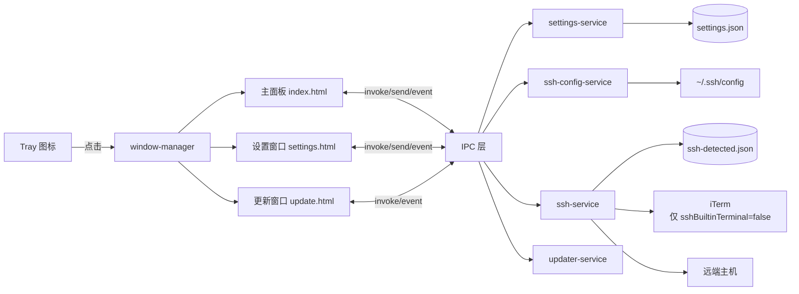
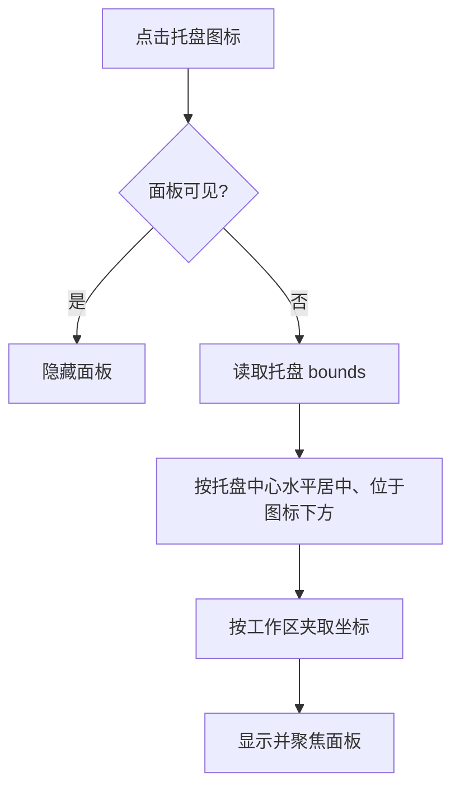
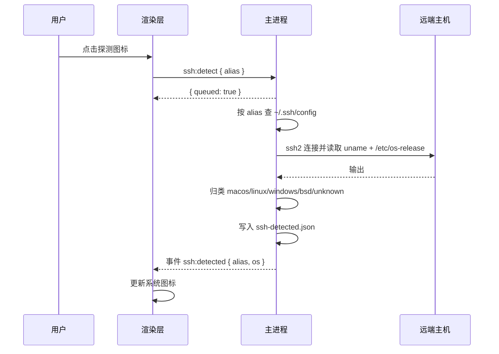
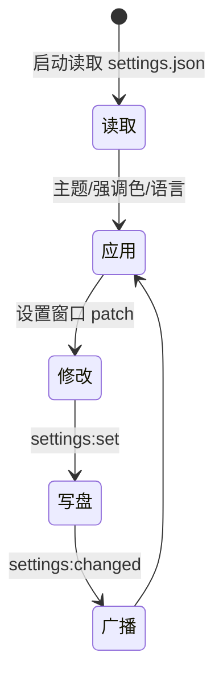
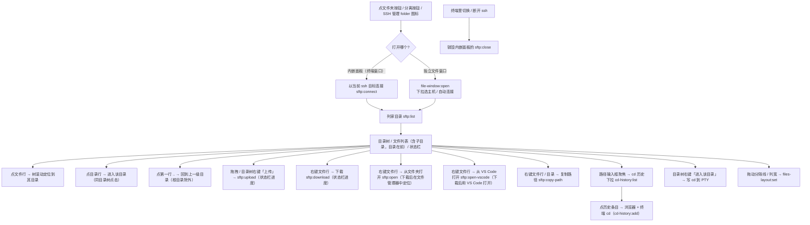
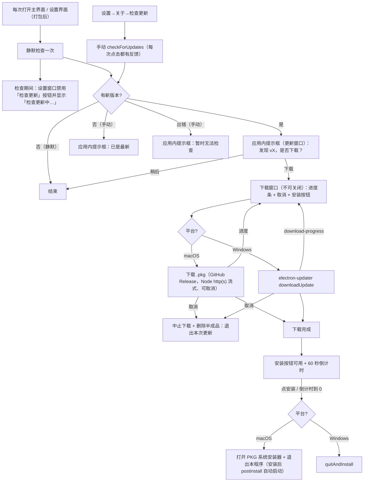

# 6. 流程图

> Index: [docs/PRD.md](../PRD.md)

### 6.1 总体架构

```mermaid
flowchart LR
  Tray[Tray 图标] -->|点击| WM[window-manager]
  WM --> Main[主面板 index.html]
  WM --> Settings[设置窗口 settings.html]
  WM --> Update[更新窗口 update.html]
  Main <-->|invoke/send/event| IPC[IPC 层]
  Settings <-->|invoke/send/event| IPC
  Update <-->|invoke/event| IPC
  IPC --> SvcSettings[settings-service]
  IPC --> SvcSshConfig[ssh-config-service]
  IPC --> SvcSsh[ssh-service]
  IPC --> SvcUpdater[updater-service]
  SvcSettings --> F1[(settings.json)]
  SvcSshConfig --> F2[~/.ssh/config]
  SvcSsh --> F3[(ssh-detected.json)]
  SvcSsh --> Iterm[iTerm<br/>仅 sshBuiltinTerminal=false]
  SvcSsh --> Remote[远端主机]
```

### 6.2 托盘面板显示流程

```mermaid
flowchart TD
  A[点击托盘图标] --> B{面板可见?}
  B -- 是 --> C[隐藏面板]
  B -- 否 --> D[读取托盘 bounds]
  D --> E[按托盘中心水平居中、位于图标下方]
  E --> F[按工作区夹取坐标]
  F --> G[显示并聚焦面板]
```

### 6.3 SSH 探测时序

```mermaid
sequenceDiagram
  participant U as 用户
  participant R as 渲染层
  participant M as 主进程
  participant H as 远端主机
  U->>R: 点击探测图标
  R->>M: ssh:detect { alias }
  M-->>R: { queued: true }
  M->>M: 按 alias 查 ~/.ssh/config
  M->>H: ssh2 连接并读取 uname + /etc/os-release
  H-->>M: 输出
  M->>M: 归类 macos/linux/windows/bsd/unknown
  M->>M: 写入 ssh-detected.json
  M-->>R: 事件 ssh:detected { alias, os }
  R->>R: 更新系统图标
```

### 6.4 设置变更生命周期

```mermaid
stateDiagram-v2
  [*] --> 读取: 启动读取 settings.json
  读取 --> 应用: 主题/强调色/语言
  应用 --> 修改: 设置窗口 patch
  修改 --> 写盘: settings:set
  写盘 --> 广播: settings:changed
  广播 --> 应用
```

---

### 6.5 文件管理（SFTP）

```mermaid
flowchart TD
  A[点文件夹按钮 / 分离按钮 / SSH 管理 folder 图标] --> B{打开哪个?}
  B -- 内嵌面板（终端窗口） --> C[以当前 ssh 目标连接 sftp:connect]
  B -- 独立文件窗口 --> D[file-window:open<br/>下拉选主机 / 自动连接]
  C --> E[列家目录 sftp:list]
  D --> E
  E --> F[目录树 / 文件列表（含子目录，目录在前）/ 状态栏]
  F --> G[点文件行 → 树滚动定位到其目录]
  F --> G2[点目录行 → 进入该目录（同目录树点击）]
  F --> G3[点第一行 .. → 回到上一级目录（根目录除外）]
  F --> H[拖拽 / 目录树右键「上传」 → sftp:upload（状态栏进度）]
  F --> I[右键文件行 → 下载 sftp:download（状态栏进度）]
  F --> I2[右键文件行 → 从文件夹打开 sftp:open（下载后在文件管理器中定位）]
  F --> I3[右键文件行 → 从 VS Code 打开 sftp:open-vscode（下载后用 VS Code 打开）]
  F --> I4[右键文件行 / 目录 → 复制路径 sftp:copy-path]
  F --> N[路径输入框聚焦 → cd 历史下拉 cd-history:list]
  N --> N2[点历史条目 → 浏览器 + 终端 cd（cd-history:add）]
  F --> J[目录树右键「进入该目录」→ 写 cd 到 PTY]
  F --> K[拖动分隔线 / 列宽 → files-layout:set]
  L[终端里切换 / 断开 ssh] --> M[销毁内嵌面板的 sftp:close]
```

### 6.6 自动更新（electron-updater）

```mermaid
flowchart TD
  A["每次打开主界面 / 设置界面（打包后）"] --> B["静默检查一次"]
  B --> B2["检查期间：设置窗口禁用「检查更新」按钮并显示「检查更新中…」"]
  J[设置→关于→检查更新] --> K["手动 checkForUpdates（每次点击都有反馈）"]
  B --> C{有新版本?}
  K --> C
  C -- 是 --> D["应用内提示框（更新窗口）：发现 vX，是否下载？"]
  C -- 否（手动） --> N[应用内提示框：已是最新]
  C -- 否（静默） --> Z[结束]
  C -- 出错（手动） --> E[应用内提示框：暂时无法检查]
  D -- 稍后 --> Z
  D -- 下载 --> W["下载窗口（不可关闭）：进度条 + 取消 + 安装按钮"]
  W --> F{平台?}
  F -- "macOS" --> F1["下载 .pkg（GitHub Release，Node http(s) 流式、可取消）"]
  F -- "Windows" --> F2["electron-updater downloadUpdate"]
  F1 -- 进度 --> W
  F2 -- download-progress --> W
  F1 -- 取消 --> X[中止下载 + 删除半成品：退出本次更新]
  F2 -- 取消 --> X
  F1 --> G[下载完成]
  F2 --> G
  G --> H["安装按钮可用 + 60 秒倒计时"]
  H -- "点安装 / 倒计时到 0" --> I{平台?}
  I -- "macOS" --> I1["打开 PKG 系统安装器 + 退出本程序（安装后 postinstall 自动启动）"]
  I -- "Windows" --> I2[quitAndInstall]
```

---
